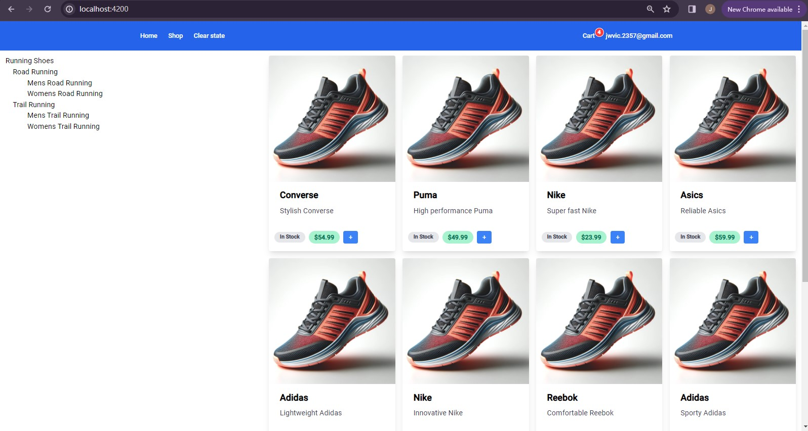

# Shoe-Shop Project README

## Project Overview
This project simulates a microservices architecture using Spring Boot 3 and Java 17, designed to model a scalable and robust system. It demonstrates the latest features and best practices for building microservices with these technologies.

## Key Features and Highlights
- Description of key features like cross-module communication (`Get /api/order/allproducts`)
- Unified exception handling with Exception Advice.
- The Category table self-joins, product can being to one category and subcategory at a time.
- Selecting a category returns all products that belong to that category or the sub-categories.

### Todo
- Modules should stay behind API Gateway.
- Upgrade DB from in-memory H2 to actual remote DB.
- Frontend should interact with API Gateway.
- There should be an inventory module, to which the order-module will call, using Eureka.
- Finish Checkout feature.

### Microservices Architecture
- **Order Service**: Manages customer orders. (Port: 8081)
- **Product Service**: Handles product details. (Port: 8082)
- **API Gateway**: Central entry point for microservices. (Port: 8090)
- **Eureka Service**: Service registry for discovering microservices. (Port: 8091)
- **Auth Service**: Manages user authentication. (Port: 8092)

### Inter-service Communication
Details on how `order-service` communicates with `product-service` for product information.

## Project Setup
Instructions for setting up the project, including details on individual `build.gradle` files for each microservice.

## API Endpoints
Overview of the available API endpoints.

### Order Service APIs
```bash
Post /api/order
    request body {
        Long customerId
        String orderDetails
    }
Get /api/order/{id}
Get /api/order/allproducts

Post /api/order/addItem
    request body {
        Long orderId
        Long productId
        Long quantity
        BigDecimal totalPrice
    }
```

### Product Service APIs
```bash
Post /api/product
    request body {
        String name
        String description
        Double price
        Long parentCategoryId
    }
Delete /api/product/{id}
Get /api/product/all

Get /api/categories
Get /api/categories/hierarchical
Get /api/categories/{categoryId}/products
```

## Code Structure
Minified view of the project's directory and file structure, highlighting key components in each microservice.

### Product Service Structure
- Key components of the Product Service.

```bash
./product-service
|-- src
|   `-- main
|       |-- java
|       |   `-- com
|       |       `-- shoeshop
|       |           |-- config
|       |           |   `-- WebConfig.java
|       |           |-- controller
|       |           |   |-- CategoryController.java
|       |           |   `-- ProductController.java
|       |           |-- dto
|       |           |   |-- CategoryDto.java
|       |           |   |-- CategoryNode.java
|       |           |   |-- ProductCreateDto.java
|       |           |   `-- ProductDto.java
|       |           |-- entity
|       |           |   |-- Category.java
|       |           |   `-- Product.java
|       |           |-- exceptions
|       |           |   |-- EntityNotFoundException.java
|       |           |   `-- ExceptionAdvice.java
|       |           |-- repository
|       |           |   |-- CategoryRepository.java
|       |           |   `-- ProductRepository.java
|       |           |-- response
|       |           |   |-- BaseResponse.java
|       |           |   |-- DataResponse.java
|       |           |   |-- FailureInfo.java
|       |           |   `-- SuccessInfo.java
|       |           |-- service
|       |           |   |-- CategoryService.java
|       |           |   `-- ProductService.java
|       |           `-- ProductApp.java
|       `-- resources
|           |-- application-prod.yml
|           |-- application.yml
|           `-- sql-init.sql
|-- Dockerfile
`-- build.gradle

14 directories, 25 files
```

### Order Service Structure
```bash
./order-service
|-- src
|   `-- main
|       |-- java
|       |   `-- com
|       |       `-- shoeshop
|       |           |-- config
|       |           |   |-- AppConfig.java
|       |           |   |-- CurrentEnvironment.java
|       |           |   |-- ProductServiceEndpointProperties.java
|       |           |   `-- WebConfig.java
|       |           |-- controller
|       |           |   |-- CustomerController.java
|       |           |   `-- OrderController.java
|       |           |-- dto
|       |           |   |-- CheckOutDto.java
|       |           |   |-- CustomerDto.java
|       |           |   |-- OrderCreateDto.java
|       |           |   |-- OrderDto.java
|       |           |   |-- OrderItemDto.java
|       |           |   `-- ProductItemDto.java
|       |           |-- entity
|       |           |   |-- Customer.java
|       |           |   |-- Order.java
|       |           |   `-- OrderItem.java
|       |           |-- enums
|       |           |   `-- PaymentStatus.java
|       |           |-- exceptions
|       |           |   |-- EntityNotFoundException.java
|       |           |   |-- ExceptionAdvice.java
|       |           |   `-- GlobalException.java
|       |           |-- repository
|       |           |   |-- CustomerRepository.java
|       |           |   |-- OrderItemRepository.java
|       |           |   `-- OrderRepository.java
|       |           |-- response
|       |           |   |-- APIResponseWrapperForJsonParsing.java
|       |           |   |-- BaseResponse.java
|       |           |   |-- DataResponse.java
|       |           |   |-- FailureInfo.java
|       |           |   `-- SuccessInfo.java
|       |           |-- service
|       |           |   |-- CustomerService.java
|       |           |   |-- OrderService.java
|       |           |   `-- ProductServiceClient.java
|       |           |-- util
|       |           |   `-- JwtVerifier.java
|       |           |-- AuditEntity.java
|       |           `-- OrderApp.java
|       `-- resources
|           |-- application-prod.yml
|           |-- application.yml
|           |-- product-service-api.json
|           `-- sql-init.sql
|-- Dockerfile
|-- build.gradle
`-- fetchApi.sh

16 directories, 40 files
```

## Database Design
- ERD Diagram with a brief explanation of the database schema.
(Work In Progress)


## Screenshots
- Screenshots of the application's UI.




## Additional Documentation
- Links to comprehensive API documentation, such as Swagger (`<service>/v3/api-docs`).
